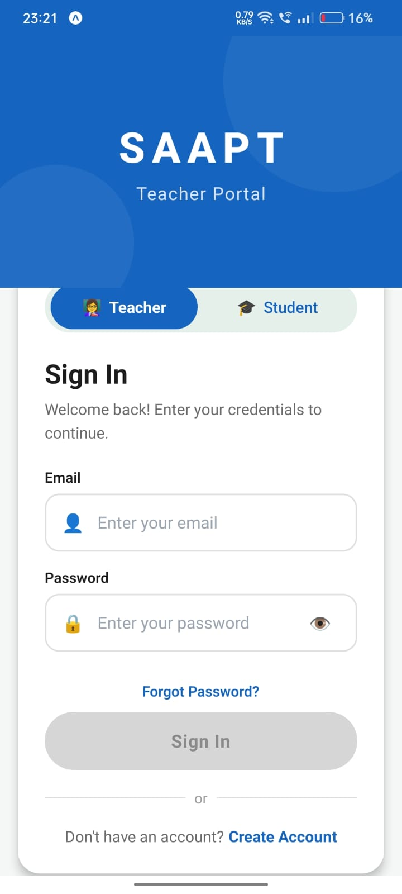
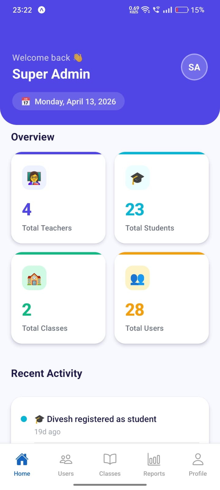
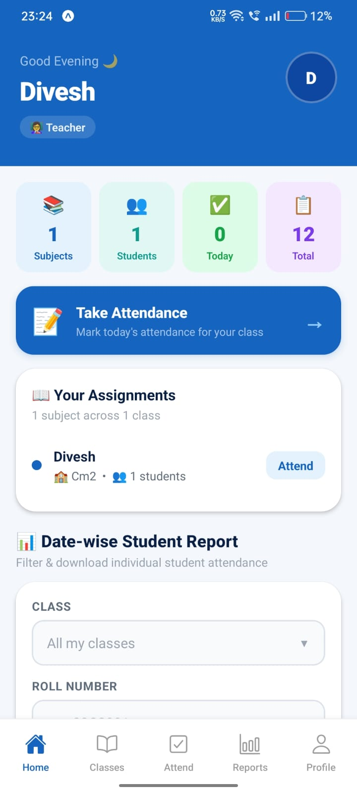
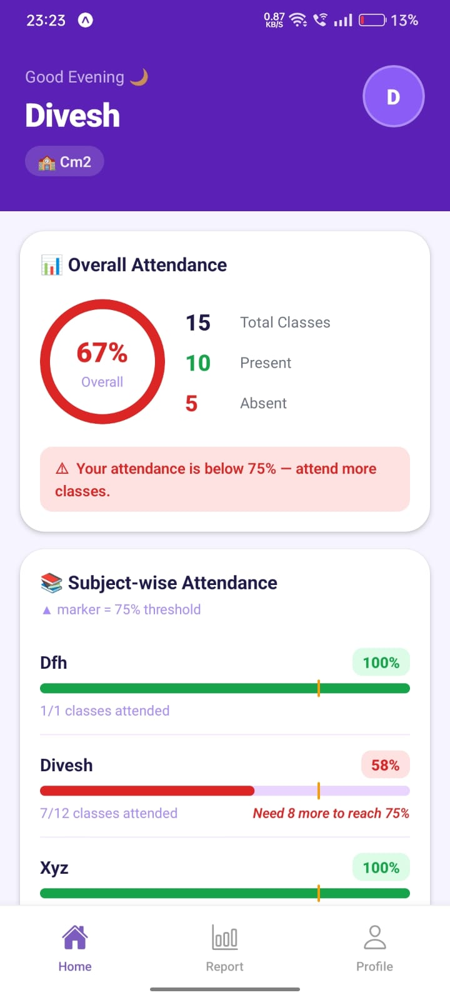
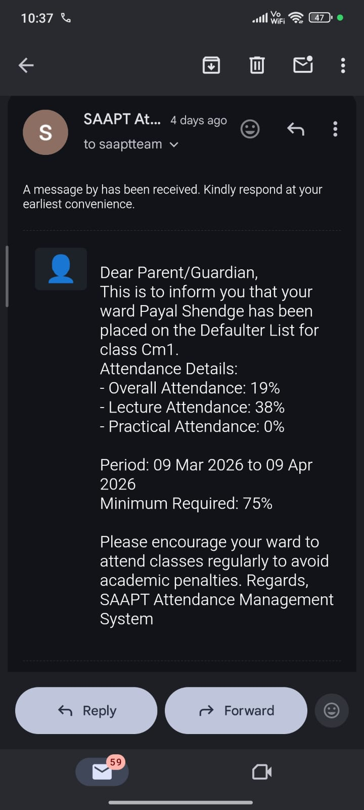
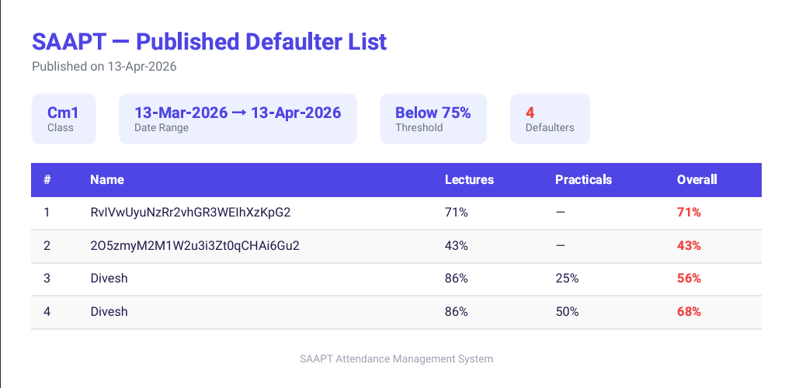

<div align="center">


<br/>
<br/>


<br/>
<br/>

> **SAAPT** is a cross-platform mobile application for smart attendance tracking and student progress monitoring.  
> Built with **React Native + Expo** and powered by **Firebase Firestore** — designed for schools and colleges.

</div>

---

## 📱 Overview

SAAPT (Smart Attendance & Progress Tracker) is a full-featured mobile attendance management system with three distinct user roles — **Admin**, **Teacher**, and **Student** — each with their own dashboard and feature set.

Teachers mark attendance subject-wise with a single tap. Students instantly see their attendance percentage and which subjects they're at risk in. Admins manage everything from one panel.

---

## 📸 Screenshots

> 💡 **How to add your screenshots:**
> 1. Create a folder called `assets/screenshots/` in your project root
> 2. Add your image files there (e.g. `login.png`, `admin.png`, etc.)
> 3. The images will automatically show up here on GitHub

<br/>

<div align="center">

### 🔐 Login Screen
<!-- PLACE YOUR IMAGE HERE: save as assets/screenshots/login.png -->


<br/><br/>

### 👑 Admin Dashboard
<!-- PLACE YOUR IMAGE HERE: save as assets/screenshots/admin.png -->


<br/><br/>

### 👩‍🏫 Teacher View
<!-- PLACE YOUR IMAGE HERE: save as assets/screenshots/teacher.png -->


<br/><br/>

### 🎓 Student Dashboard
<!-- PLACE YOUR IMAGE HERE: save as assets/screenshots/student.png -->


<br/><br/>

### 📧 Email Report
<!-- PLACE YOUR IMAGE HERE: save as assets/screenshots/email.png -->


<br/><br/>

### 📄 Defaulter PDF Export
<!-- PLACE YOUR IMAGE HERE: save as assets/screenshots/defaulter_pdf.png -->


</div>

---

## ✨ Features

### 👑 Admin
- Dashboard with live user, class, and attendance statistics
- Create and manage users (teachers & students) with Firebase Auth integration
- 3-step guided class creation: create class → create subject → assign subject to class
- Batch subject assignment with atomic Firestore writes
- Reports: filter attendance by class or individual student

### 👩‍🏫 Teacher
- View all assigned classes and subjects
- Mark attendance with a 3-state toggle: **Unmarked → Present → Absent**
- "Mark All Present" shortcut for quick full-class entry
- Progress bar showing marked vs unmarked count before saving
- Edit today's attendance if already submitted
- Expandable subject-wise report with student search
- Defaulters tab showing students below 75%

### 🎓 Student
- Home dashboard with overall and subject-wise attendance percentages
- 75% threshold marker on animated progress bars
- Shows exactly how many more classes are needed to reach 75%
- Today's attendance card
- Full report screen with two tabs: **My Attendance** and **Class Defaulters**
- Profile screen with academic details

### 🔐 Common
- Firebase email/password authentication
- AsyncStorage session persistence (stay logged in after closing app)
- Pull-to-refresh on all data screens
- Password reset via email
- Edit profile (name, phone number)
- Animated UI with bottom sheets, progress bars, and smooth transitions

---

## 🛠 Tech Stack

| Layer | Technology |
|---|---|
| Framework | React Native 0.81.5 + Expo ~54 |
| Database | Firebase Firestore |
| Authentication | Firebase Auth |
| Navigation | React Navigation v7 (Stack + Bottom Tabs) |
| Local Storage | @react-native-async-storage/async-storage |
| Email | @emailjs/react-native |
| File Export | expo-print + expo-sharing + xlsx |
| Icons | @expo/vector-icons (Ionicons) |
| Network Detection | @react-native-community/netinfo |

---

## 🗂 Project Structure

```
src/
├── navigation/
│   ├── RootNavigator.js       # Entry: auth check + role-based routing
│   ├── AuthNavigator.js       # Login + Signup
│   ├── AdminNavigator.js      # Admin bottom tabs
│   ├── TeacherNavigator.js    # Teacher bottom tabs
│   └── StudentNavigator.js    # Student bottom tabs
├── screens/
│   ├── admin/
│   │   ├── DashboardScreen.js
│   │   ├── UsersScreen.js
│   │   ├── ClassesScreen.js
│   │   ├── ReportsScreen.js
│   │   └── ProfileScreen.js
│   ├── auth/
│   │   ├── LoginScreen.js
│   │   └── SignupScreen.js
│   ├── teacher/
│   │   ├── HomeScreen.js
│   │   ├── ClassesScreen.js
│   │   ├── AttendanceScreen.js
│   │   ├── ReportScreen.js
│   │   └── ProfileScreen.js
│   └── student/
│       ├── HomeScreen.js
│       ├── ReportScreen.js
│       └── ProfileScreen.js
├── services/
│   └── firebase/
│       ├── config.js          # Firebase initialization
│       ├── auth.js            # Auth helper functions
│       └── seed.js            # One-time admin account seeder
└── theme/
    └── index.js               # Colors, Typography, Spacing, Radius
```

## 🚀 Getting Started

### Prerequisites
- Node.js 18+
- npm or yarn
- Expo CLI: `npm install -g expo-cli`
- Expo Go app on your phone (for testing)

### Installation

```bash
# 1. Clone the repository
git clone https://github.com/YOUR_USERNAME/SAAPT.git
cd SAAPT

# 2. Install dependencies
npm install

# 3. Add your Firebase config
# Open src/services/firebase/config.js and replace with your own Firebase project credentials

# 4. Start the development server
npx expo start
```

### First-Time Admin Setup

The app requires at least one admin account to get started.

1. Open `src/screens/auth/LoginScreen.js`
2. Uncomment the `seedAdmin()` call inside `useEffect`:
   ```js
   useEffect(() => {
     seedAdmin();
   }, []);
   ```
3. Run the app once — the admin account `admin@saapt.app` will be created
4. Re-comment the `seedAdmin()` line immediately
5. Log in with `admin@saapt.app` / `admin123` and change the password right away

---

## 🔒 Security Notes

> ⚠️ Before deploying or sharing this project publicly:

- Move your Firebase config to environment variables using `expo-constants` and a `.env` file
- Add `.env` to `.gitignore` to prevent API key exposure
- Set up [Firestore Security Rules](https://firebase.google.com/docs/firestore/security/get-started) so users can only read/write their own data
- Delete `seed.js` after creating the admin account
- Change the default admin password immediately after first login

---

## 📐 Attendance Algorithm

**Percentage formula:**
```
attendance % = (present / total) × 100
```

**Classes needed to reach 75%:**
```
classes_needed = ceil((75 × total − 100 × present) / (100 − 75))
```

A student is marked as a **defaulter** if their attendance in any subject falls below **75%**.

---

## 🗺 Roadmap

- [ ] Push notifications for low attendance alerts
- [ ] QR code-based attendance marking
- [ ] Export reports as PDF / Excel
- [ ] Offline mode with auto-sync
- [ ] Email attendance reports to parents
- [ ] Dark mode
- [ ] Monthly attendance calendar view
- [ ] Biometric login (Touch ID / Face ID)

---

## 🤝 Contributing

Pull requests are welcome. For major changes, please open an issue first to discuss what you'd like to change.

1. Fork the repository
2. Create your feature branch: `git checkout -b feature/YourFeature`
3. Commit your changes: `git commit -m 'Add YourFeature'`
4. Push to the branch: `git push origin feature/YourFeature`
5. Open a Pull Request

---

## 👨‍💻 Authors

<table>
  <tr>
    <td align="center">
      <b>Divesh Koli</b><br/>
      <br/>
      <a href="mailto:kolidivesh05@gmail.com">
        
      </a>
      <br/>
      <a href="https://instagram.com/diveshdkoli" target="_blank">
        
      </a>
    </td>
    <td align="center">
      <b>Siddhesh Shinde</b><br/>
      <br/>
      <a href="mailto:siddheshshinde42556@gmail.com">
        
      </a>
      <br/>
      <a href="https://instagram.com/__siddhesh._.07" target="_blank">
        
      </a>
    </td>
  </tr>
</table>

---

## 📄 License

This project is licensed under the [MIT License](LICENSE).

---

<div align="center">
  <sub>Built with ❤️ using React Native + Firebase | SAAPT v1.0.0</sub>
</div>
